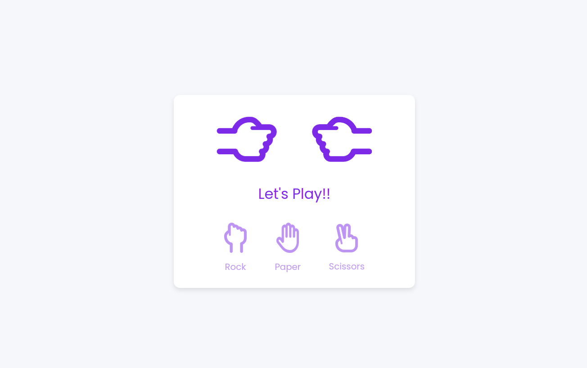

# Rock Paper Scissors Game

  

<h1 align="center">
  Rock Paper Scissors Game Version 1
</h1>

  

## Open the Project
1. Open the project folder in your VS Code.

## Run the Project
1. Start Using Live Server.

Click on the `localhost` link that appears in the terminal to open the project in your browser and check its functionality.

